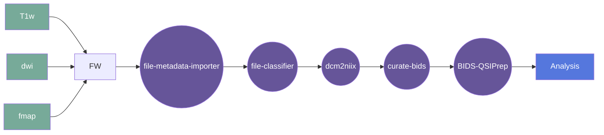

# QSIprep Gear

This gear runs [QSIprep](https://qsiprep.readthedocs.io/) on
[BIDS-curated data](https://bids.neuroimaging.io/).

For a description of what QSIprep does, read the
[official documentation](https://qsiprep.readthedocs.io/).  

This gear runs the official
[`pennbbl/qsiprep:0.15.4` Docker image](https://hub.docker.com/r/pennbbl/qsiprep)

## Overview

[Usage](#usage)

[FAQ](#faq)

### Summary

`qsiprep` configures pipelines for processing diffusion-weighted MRI (dMRI) data. The main
features of this software are:

  1. A BIDS-app approach to preprocessing nearly all kinds of modern diffusion MRI data.
  2. Automatically generated preprocessing pipelines that correctly group, distortion correct,
     motion correct, denoise, coregister and resample your scans, producing visual reports
     and QC metrics.
  3. A system for running state-of-the-art reconstruction pipelines that include algorithms
     from Dipy, MRTrix, DSI Studio  and others.
  4. A novel motion correction algorithm that works on DSI and random q-space sampling schemes

### Cite

**license:**

* QSIPrep: [BSD-3-Clause](https://github.com/PennLINC/qsiprep/blob/0.15.4/LICENSE)
* Dependencies:
  * FSL: <https://fsl.fmrib.ox.ac.uk/fsl/fslwiki/Licence>
  * ANTs: <https://github.com/ANTsX/ANTs/blob/v2.2.0/COPYING.txt>
  * AFNI: <https://afni.nimh.nih.gov/pub/dist/doc/program_help/README.copyright.html>
  * DSI-Studio: <https://dsi-studio.labsolver.org/download.html>
  * MRtrix3: <https://github.com/MRtrix3/mrtrix3/blob/master/LICENCE.txt>

**url:** <https://gitlab.com/flywheel-io/flywheel-apps/bids-qsiprep>

**cite:** <https://qsiprep.readthedocs.io/en/latest/citing.html>

### Classification

*Category:* analysis

*Gear Level:*

* [ ] Project
* [x] Subject
* [x] Session
* [ ] Acquisition
* [ ] Analysis

----

[[*TOC*]]

----

### Inputs

* bidsignore
  * **Name**: bidsignore
  * **Type**: object
  * **Optional**: true
  * **Classification**: file
  * **Description**: A .bidsignore file to provide to the bids-validator that this gear
runs before running the main command.

* eddy-config
  * **Name**: eddy-config
  * **Type**: object
  * **Optional**: true
  * **Classification**: file
  * **Description**: Path to a json file with settings for the call to eddy. If no json
is specified, a default one will be used. The current default json can be found here:
<https://github.com/PennBBL/qsiprep/blob/master/qsiprep/data/eddy_params.json>

* freesurfer_license
  * **Name**: freesurfer_license
  * **Type**: object
  * **Optional**: true
  * **Classification**: file
  * **Description**: FreeSurfer license file, provided during registration with
FreeSurfer. This file will be copied to the `$FSHOME` directory and used during
execution of the Gear.

* api-key
  * **Name**: api-key
  * **Type**: object
  * **Optional**: true
  * **Classification**: api-key
  * **Description**: Flywheel API key.

* recon-spec
  * **Name**: recon-spec
  * **Type**: object
  * **Optional**: true
  * **Classification**: file
  * **Description**: json file specifying a reconstruction pipeline to be run after preprocessing.

### Config

* debug
  * **Name**: debug
  * **Type**: boolean
  * **Description**: Log debug messages
  * **Default**: false

* bids_app_args
  * **Name**: bids_app_args
  * **Type**: string
  * **Description**: Extra arguments to pass to the BIDS App, space-separated:
`[arg1 [arg2 ...]]`
  * **Default**: "" (empty)

* interactive-reports-only
  * **Name**: interactive-reports-only
  * **Type**: boolean
  * **Description**: create interactive report json files on already preprocessed data.
  * **Optional**: true

* acquisition_type
  * **Name**: acquisition_type
  * **Type**: string
  * **Description**: select a specific acquisition type to be processed.
  * **Optional**: true

* anat-only
  * **Name**: anat-only
  * **Type**: boolean
  * **Description**: run anatomical workflows only.
  * **Optional**: true

* dwi-only
  * **Name**: dwi-only
  * **Type**: boolean
  * **Description**: ignore anatomical (T1w/T2w) data and process DWIs only.
  * **Optional**: true

* infant
  * **Name**: infant
  * **Type**: boolean
  * **Description**: configure pipelines to process infant brains.
  * **Optional**: true

* boilerplate
  * **Name**: boilerplate
  * **Type**: boolean
  * **Description**: generate boilerplate only.
  * **Optional**: true

* longitudinal
  * **Name**: longitudinal
  * **Type**: boolean
  * **Description**: treat dataset as longitudinal - may increase runtime.
  * **Optional**: true

* b0-threshold
  * **Name**: b0-threshold
  * **Type**: number
  * **Description**: any value in the .bval file less than this will be considered a
b=0 image. Current default threshold = 100; this threshold can be lowered or increased.
Note, setting this too high can result in inaccurate results.
  * **Optional**: true

* dwi_denoise_window
  * **Name**: dwi_denoise_window
  * **Type**: integer
  * **Description**: window size in voxels for dwidenoise. Must be odd (default: 5). If
`0`, dwidwenoise will not be run.
  * **Optional**: true

* denoise-method
  * **Name**: denoise-method
  * **Type**: string
  * **Description**: Image-based denoising method. Either `dwidenoise` (MRtrix),
`patch2self` (DIPY) or none.
  * **Optional**: true

* unringing-method
  * **Name**: unringing-method
  * **Type**: string
  * **Description**: mrdegibbs: use mrdegibbs from mrtrix3.
  * **Optional**: true

* dwi-no-biascorr
  * **Name**: dwi-no-biascorr
  * **Type**: boolean
  * **Description**: skip b0-based dwi spatial bias correction.
  * **Optional**: true

* no-b0-harmonization
  * **Name**: no-b0-harmonization
  * **Type**: boolean
  * **Description**: skip re-scaling dwi scans to have matching b=0 intensities.
  * **Optional**: true

* denoise-after-combining
  * **Name**: denoise-after-combining
  * **Type**: boolean
  * **Description**: run dwidenoise after combining dwis. Requires --combine-all-dwis.
  * **Optional**: true

* denoise-after-combining
  * **Name**: denoise-after-combining
  * **Type**: boolean
  * **Description**: run dwidenoise after combining dwis. Cannot be used with --separate-all-dwis.
  * **Optional**: true

* separate-all-dwis
  * **Name**: separate-all-dwis
  * **Type**: boolean
  * **Description**: don't attempt to combine dwis from multiple runs. Each will be
processed separately.
  * **Optional**: true

* distortion-group-merge
  * **Name**: distortion-group-merge
  * **Type**: string
  * **Description**: Possible choices: concat, average, none.
    * concatenate: append images in the 4th dimension
    * average: if a whole sequence was duplicated in both PE directions, average the
    * corrected images of the same q-space coordinate
    * none: Default. Keep distorted groups separate.
  * **Optional**: true

* write-local-bvecs
  * **Name**: write-local-bvecs
  * **Type**: boolean
  * **Description**: write a series of voxelwise bvecs, relevant if writing
preprocessed dwis to template space.
  * **Optional**: true

* output-space
  * **Name**: output-space
  * **Type**: string
  * **Description**: Volume and surface spaces to resample dwis into
    * T1w: subject anatomical volume
    * template: deprecated. Will be ignored.
  * **Optional**: true

* template
  * **Name**: template
  * **Type**: string
  * **Description**: Volume template space (default: MNI152NLin2009cAsym)
  * **Optional**: true

* output-resolution
  * **Name**: output-resolution
  * **Type**: number
  * **Description**: the isotropic voxel size in mm the data will be resampled to after
preprocessing. If set to a lower value than the original voxel size, your data will be
upsampled using BSpline interpolation.
  * **Optional**: true

* b0-to-t1w-transform
  * **Name**: b0-to-t1w-transform
  * **Type**: string
  * **Description**: Degrees of freedom when registering b0 to T1w images. 6 degrees
(rotation and translation) are used by default.
  * **Optional**: true

* intramodal-template-iters
  * **Name**: intramodal-template-iters
  * **Type**: integer
  * **Description**: Number of iterations for finding the midpoint image from the b0
templates from all groups. Has no effect if there is only one group. If 0, all b0
templates are directly registered to the t1w image.
  * **Optional**: true

* intramodal-template-transform
  * **Name**: intramodal-template-transform
  * **Type**: string
  * **Description**: Transformation used for building the intramodal template.
  * **Optional**: true

* b0-motion-corr-to
  * **Name**: intramodal-template-transform
  * **Type**: string
  * **Description**: align to the 'first' b0 volume or do an 'iterative' registration
of all b0 images to their midpoint image (default: iterative).
  * **Optional**: true

* hmc-transform
  * **Name**: hmc-transform
  * **Type**: string
  * **Description**: transformation to be optimized during head motion correction
(default: affine).
  * **Optional**: true

* hmc_model
  * **Name**: hmc_model
  * **Type**: string
  * **Description**: model used to generate target images for hmc. If `none` the non-b0
images will be warped using the same transform as their nearest b0 image. If `3dSHORE`,
SHORELine will be used. If `eddy_ingress`, the dwis are assumed to have been run
through FSL's `eddy`.
  * **Optional**: true

* shoreline_iters
  * **Name**: shoreline_iters
  * **Type**: integer
  * **Description**: number of SHORELine iterations. (default: 2).
  * **Optional**: true

* impute-slice-threshold
  * **Name**: impute-slice-threshold
  * **Type**: number
  * **Description**: impute data in slices that are this many SDs from expected. If 0
(default), no slices will be imputed.
  * **Optional**: true

* skull-strip-template
  * **Name**: skull-strip-template
  * **Type**: string
  * **Description**: select ANTs skull-stripping template (default: OASIS)
  * **Optional**: true

* skull-strip-fixed-seed
  * **Name**: skull-strip-fixed-seed
  * **Type**: string
  * **Description**: do not use a random seed for skull-stripping - will ensure
run-to-run replicability when used with -omp-nthreads 1
  * **Optional**: true

* skip-t1-based-spatial-normalization
  * **Name**: skip-t1-based-spatial-normalization
  * **Type**: boolean
  * **Description**: skip running the t1w-based normalization to template space.
Default is to run the normalization.
  * **Optional**: true

* do-reconall
  * **Name**: do-reconall
  * **Type**: boolean
  * **Description**: Run the FreeSurfer recon-all pipeline.
  * **Optional**: true

* prefer_dedicated_fmaps
  * **Name**: prefer_dedicated_fmaps
  * **Type**: boolean
  * **Description**: forces unwarping to use files from the fmap directory instead of
using an RPEdir scan from the same session.
  * **Optional**: true

* fmap-bspline
  * **Name**: fmap-bspline
  * **Type**: boolean
  * **Description**: fit a B-Spline field using least-squares (experimental).
  * **Optional**: true

* fmap-no-demean
  * **Name**: fmap-no-demean
  * **Type**: boolean
  * **Description**: do not remove median (within mask) from fieldmap (default: True)
  * **Optional**: true

* use-syn-sdc
  * **Name**: use-syn-sdc
  * **Type**: boolean
  * **Description**: EXPERIMENTAL: Use fieldmap-free distortion correction. To use this
option, 'template' must be passed to -output-space.
  * **Optional**: true

* force-syn
  * **Name**: force-syn
  * **Type**: boolean
  * **Description**: EXPERIMENTAL/TEMPORARY: Use SyN correction in addition to fieldmap
correction, if available.
  * **Optional**: true

* reports-only
  * **Name**: reports-only
  * **Type**: boolean
  * **Description**: only generate reports, don't run workflows. This will only rerun
report aggregation, not reportlet generation for specific nodes.
  * **Optional**: true

* verbose
  * **Name**: verbose
  * **Type**: string
  * **Description**: increases log verbosity for each occurrence, debug level is `-vvv`
  * **Optional**: true

* n_cpus
  * **Name**: n_cpus
  * **Type**: integer
  * **Description**: Number of CPUs/cores to use. Leave blank or set to `0` to use the
maximum available in the system.
  * **Optional**: true

* mem_mb
  * **Name**: mem_mb
  * **Type**: integer
  * **Description**: Maximum memory to use (MB). Leave blank or set to 0 to use the
maximum available in the system.
  * **Optional**: true

* write-graph
  * **Name**: write-graph
  * **Type**: boolean
  * **Description**: Write workflow graph.
  * **Optional**: true

* ignore
  * **Name**: ignore
  * **Type**: string
  * **Description**: Ignore selected aspects of the input dataset to disable
corresponding parts of the workflow (a space delimited list)  Possible choices:
`fieldmaps`, `slicetiming`, `sbref`.
  * **Optional**: true

* gear-ignore-bids-errors
  * **Name**: gear-ignore-bids-errors
  * **Type**: boolean
  * **Description**: By default, the gear will not run if there are any BIDS errors
detected. Set this to run even if BIDS errors are detected.
  * **Optional**: true

* gear-run-bids-validation
  * **Name**: gear-run-bids-validation
  * **Type**: boolean
  * **Description**: Gear will run BIDS validation after downloading data.  If
validation fails `qsiprep` will NOT be run.
  * **Optional**: true

* gear-save-intermediate-output
  * **Name**: gear-save-intermediate-output
  * **Type**: boolean
  * **Description**: Gear will save ALL intermediate output into `qsiprep_work.zip`.
  * **Optional**: true

* gear-intermediate-files
  * **Name**: gear-intermediate-files
  * **Type**: string
  * **Description**: Space separated list of FILES to retain from the intermediate work
directory.
  * **Optional**: true

* gear-intermediate-folders
  * **Name**: gear-intermediate-folders
  * **Type**: boolean
  * **Description**: Space separated list of FOLDERS to retain from the intermediate work
directory.
  * **Optional**: true

* gear-dry-run
  * **Name**: gear-dry-run
  * **Type**: boolean
  * **Description**: Do everything except actually executing `qsiprep`.
  * **Optional**: true

* gear-keep-output
  * **Name**: gear-keep-output
  * **Type**: boolean
  * **Description**: Don't delete output.  Output is always zipped into a single file
for easy download.  Choose this option to prevent output deletion after zipping.
  * **Optional**: true

* gear-FREESURFER_LICENSE
  * **Name**: gear-FREESURFER_LICENSE
  * **Type**: string
  * **Description**: Text from license file generated during FreeSurfer registration.
*Entries should be space separated*.
  * **Optional**: true

### Outputs

Please refer to the [official documentation](https://qsiprep.readthedocs.io/)

#### Metadata

Any notes on metadata created by this gear

### Pre-requisites

This section contains any prerequisites

#### Prerequisite Gear Runs

This gear runs on BIDS-organized data. To have your data BIDS-ified, it is recommended
that you run, in the following order:

1. ***dcm2niix***
    * Level: Any
2. ***file-metadata-importer***
    * Level: Any
3. ***file-classifier***
    * Level: Any

#### Prerequisite

This BIDS-App runs FreeSurfer, so you need to provide a valid FreeSurfer license.

Supported ways to provide the license are documented [here](
https://docs.flywheel.io/hc/en-us/articles/360013235453)

## Usage

This section provides a more detailed description of the gear, including not just WHAT
it does, but HOW it works in flywheel

### Description

This gear is run at either the `Subject` or the `Session` level. It downloads the data
for that subject/session into the `/flwyhweel/v0/work/bids` folder and then runs the
`QSIprep` pipeline on it.

After the pipeline is run, the output folder is zipped and saved into the analysis
container.

#### File Specifications

This section contains specifications on any input files that the gear may need

### Workflow

A picture and description of the workflow

Description of workflow

1. Upload data to container
2. Prepare data by running the following gears:
   1. file metadata importer
   2. file classifier
   3. dcm2niix
   4. MRIQC (optional)
   5. curate bids
3. Select either a subject or a session.
4. Run the BIDS-QSIPrep gear
5. Gear places output in Analysis

### Use Cases

Please, refer to the [official documentation](
https://qsiprep.readthedocs.io/en/latest/preprocessing.html)

## FAQ

[FAQ.md](FAQ.md)

## Contributing

[For more information about how to get started contributing to that gear,
checkout [CONTRIBUTING.md](CONTRIBUTING.md).]
